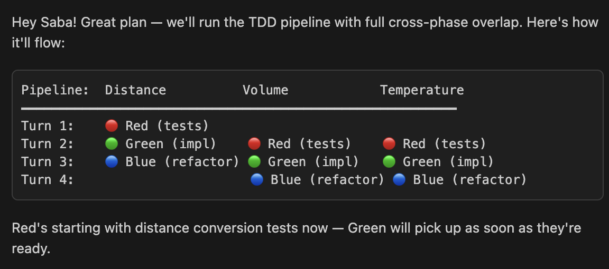
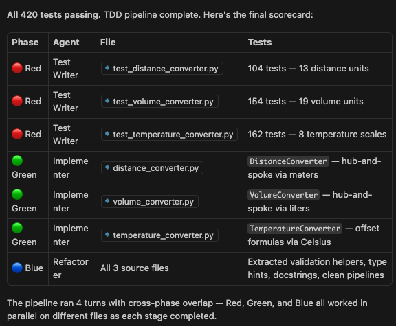

# TDD Squad

TDD Squad is a multi-agent Test-Driven Development pipeline for GitHub Copilot, built with the [Squad SDK](https://github.com/bradygaster/squad). It encodes the classic Red-Green-Blue TDD cycle as a team of cooperating AI agents: **Red** writes failing tests, **Green** implements the minimum code to make them pass, and **Blue** refactors while keeping all tests green. A **Scribe** agent silently logs decisions and session history.

What makes it powerful is **cross-phase overlap** — agents work in parallel on different files as each stage completes, so you don't wait for the entire Red phase to finish before Green starts. You describe a feature in plain language and the squad coordinates the full TDD pipeline automatically.

### Prompt



The user asks the squad to create three Python classes for unit conversions (distance, volume, temperature). The coordinator plans a 4-turn pipeline where Red, Green, and Blue overlap across files — as soon as Red finishes tests for the first file, Green starts implementing it while Red moves on to the next.

> I want you all to work in parallel and create three Python classes, each responsible for unit conversions. One is for distance units conversions, second is volume units of measurements conversion, and third one is temperature, units of conversions. Make it as comprehensive as you can. Forget about the human approval gate, and consider them pre-approved. When red is done with the first file, have green start implementing the class for that file so that the agents can work in parallel as they make progress.

### Result



---

## Prerequisites

- Node.js >= 22.5
- npm >= 10.x
- [Squad CLI](https://github.com/bradygaster/squad) installed (`npm install -g @bradygaster/squad-cli`)

---

## Setup

```bash
git clone <repo-url>
cd tdd-squad
npm install
```

---

## Usage

### 1. Generate `squad.config.ts` in your project

```bash
# Generate in the current directory
npm start

# Generate in another repository
npm start -- ~/code/my-project
```

This creates a `squad.config.ts` in the target directory using the Squad SDK builders (`defineSquad`, `defineTeam`, `defineAgent`, `defineRouting`).

### 2. Install the Squad SDK, init, and build

```bash
cd ~/code/my-project
npm install @bradygaster/squad-sdk
squad init
squad build
```

`squad init` scaffolds the Squad in your project (creates `squad.agent.md`, workflows, identity, etc.). `squad build` then generates the `.squad/` agent charters and governance files from your `squad.config.ts`.

### 3. Use the Squad in GitHub Copilot

Open the target repo in VS Code, select the Squad agent, and describe a feature:

```
Add email validation to the User class
```

The coordinator runs the full TDD cycle: Red → (human review) → Green → Blue.

---

## Workflow

```
🔴 Red (write failing tests)
  │
  ▼
⏸  Human Gate — review tests before proceeding
  │
  ▼
🟢 Green (minimum code to pass tests)
  │
  ▼
🔵 Blue (refactor, keep tests green)
  │
  ▼
✅ Cycle complete
```

| Agent | Phase | Role |
|-------|-------|------|
| Red | Write failing tests | Creates test cases before implementation exists |
| Green | Make tests pass | Implements minimum code — nothing more |
| Blue | Refactor | Improves code quality, all tests must stay green |
| Scribe | Logging | Records decisions and session history (silent) |

---

## Project Structure

```
tdd-squad/
  index.ts           # CLI entry point — runs the generator
  generate.ts        # Generates squad.config.ts content
  package.json
  tsconfig.json
```

---

## Re-running

Running `npm start` again is safe — an existing `squad.config.ts` is skipped, not overwritten. To regenerate, delete it and run again.

---

## License

MIT
